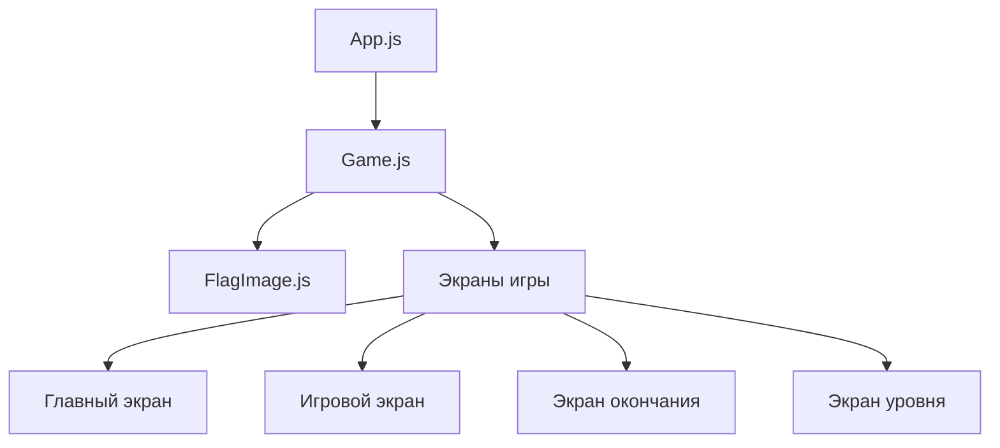
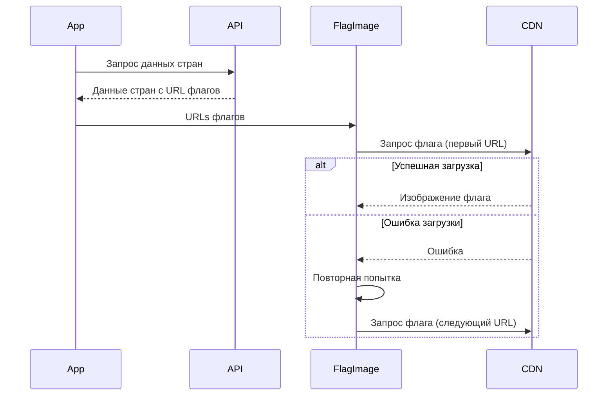
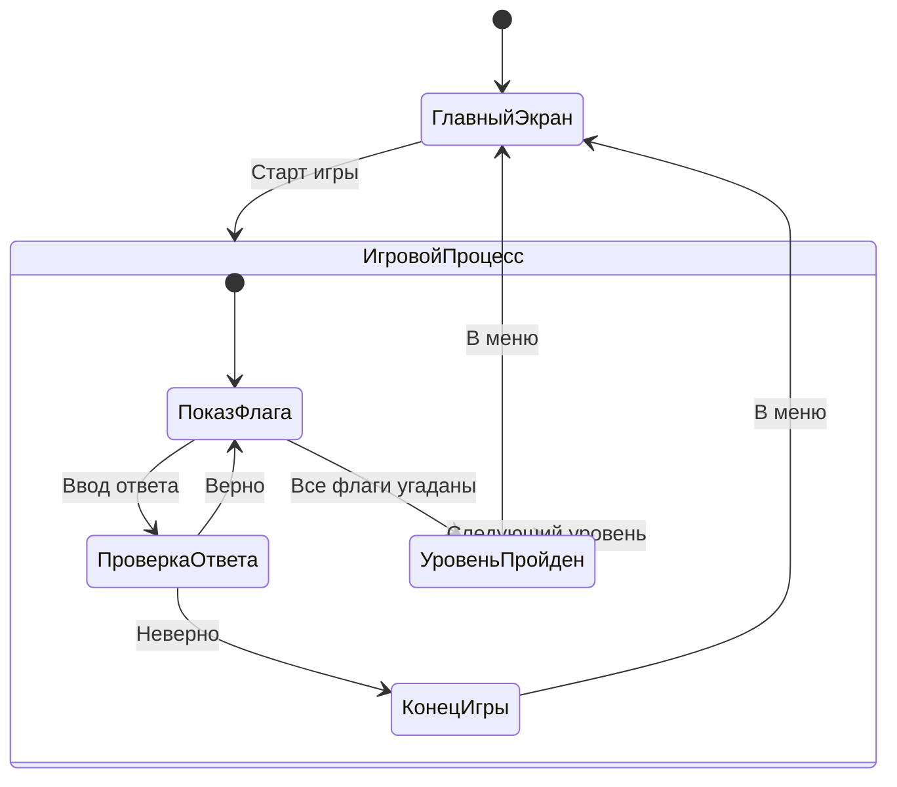

# 🌍 Угадай Флаг

Интерактивная игра для проверки знаний флагов стран мира. Проект разработан с использованием React и современных веб-технологий.

## 📋 Содержание

- [Особенности](#особенности)
- [Технологии](#технологии)
- [Установка](#установка)
- [Как играть](#как-играть)
- [Уровни сложности](#уровни-сложности)
- [Техническая реализация](#техническая-реализация)
- [Разработка](#разработка)

## ✨ Особенности

- 🎮 Три уровня сложности
- 🏆 Система подсчета очков и рекордов
- 🌐 Поддержка русского и английского названий стран
- 🔄 Надежная система загрузки флагов с несколькими резервными источниками
- 📱 Адаптивный дизайн
- 💾 Сохранение лучших результатов
- ⚡ Быстрая загрузка и отзывчивый интерфейс

## 🛠 Технологии

- React
- CSS3 с современными функциями
- REST Countries API
- Local Storage для сохранения результатов
- Множественные API источники флагов для надежности

## 🚀 Установка

1. Клонируйте репозиторий:
```bash
git clone [URL репозитория]
```

2. Перейдите в директорию проекта:
```bash
cd guesser
```

3. Установите зависимости:
```bash
npm install
```

4. Запустите проект:
```bash
npm start
```

## 🎮 Как играть

1. Выберите уровень сложности на начальном экране
2. Вам будет показан флаг страны
3. Введите название страны в поле ввода
   - Принимаются названия на русском языке
   - Регистр не имеет значения
4. Нажмите Enter или кнопку "Проверить"
5. Если ответ правильный:
   - Получите очко
   - Переходите к следующему флагу
6. Если ответ неправильный:
   - Игра завершается
   - Показывается правильный ответ
   - Можно начать новую игру или вернуться в меню

## 🎯 Уровни сложности

### 🏃 Легкий уровень
- Самые известные страны мира
- Включает: Россия, США, Китай, Германия, Великобритания и другие популярные страны
- Идеально для начинающих

### 👤 Средний уровень
- Менее известные, но узнаваемые страны
- Включает: Аргентина, Таиланд, Хорватия, Чехия и другие
- Для тех, кто уже знаком с основными флагами

### 🎓 Сложный уровень
- Редкие и малоизвестные страны
- Все оставшиеся страны мира
- Для настоящих экспертов по флагам

## 💻 Техническая реализация

### Архитектура приложения

#### Компонентная структура



#### Управление состоянием

```typescript
// Основные состояния игры
interface GameState {
    currentDifficulty: 'easy' | 'medium' | 'hard';
    currentScore: number;
    bestScores: {
        easy: number;
        medium: number;
        hard: number;
    };
    showHomeScreen: boolean;
    showGameScreen: boolean;
    showGameOverScreen: boolean;
    showLevelCompleteScreen: boolean;
}

// Структура данных страны
interface Country {
    name: string;
    russianName: string;
    flagUrls: string[];
    population: number;
    area: number;
}
```

### Детальное описание компонентов

#### 1. FlagImage Component

Компонент отвечает за надежную загрузку изображений флагов с поддержкой повторных попыток:

```javascript
const FlagImage = ({ urls, alt, className }) => {
    const [index, setIndex] = useState(0);
    const [retryCount, setRetryCount] = useState(0);
    
    // Логика обработки ошибок загрузки
    const handleError = () => {
        if (retryCount < MAX_RETRIES) {
            // Повторная попытка с тем же URL
            setRetryCount(prev => prev + 1);
        } else {
            // Переход к следующему URL
            setIndex(prev => prev + 1);
            setRetryCount(0);
        }
    };
    
    return ;
};
```

#### 2. Game Component

##### Инициализация и загрузка данных

```javascript
// Загрузка стран с API
async function fetchCountries() {
    const response = await fetch('https://restcountries.com/v3.1/all');
    const data = await response.json();
    
    return data.map(country => ({
        name: country.name.common,
        russianName: country.translations.rus.common,
        flagUrls: [
            country.flags.svg,
            country.flags.png,
            `https://flagcdn.com/w320/${country.cca2.toLowerCase()}.png`,
            // Дополнительные URL
        ]
    }));
}
```

##### Фильтрация стран по сложности

```javascript
const filterCountriesByDifficulty = (countries) => {
    return {
        easy: countries.filter(c => popularCountries.includes(c.name)),
        medium: countries.filter(c => mediumPopularCountries.includes(c.name)),
        hard: countries.filter(c => 
            !popularCountries.includes(c.name) && 
            !mediumPopularCountries.includes(c.name)
        )
    };
};
```

##### Логика проверки ответов

```javascript
const checkAnswer = (userInput: string, country: Country): boolean => {
    const normalizedInput = userInput.toLowerCase().trim();
    const normalizedName = country.russianName.toLowerCase();
    const normalizedEnglishName = country.name.toLowerCase();
    
    return normalizedInput === normalizedName || 
           normalizedInput === normalizedEnglishName;
};
```

### Алгоритмы и процессы

#### 1. Процесс загрузки флагов



#### 2. Жизненный цикл игры



### Система очков и достижений

#### Подсчет очков

```javascript
const updateScore = (currentScore: number, difficulty: string): number => {
    const multipliers = {
        easy: 1,
        medium: 2,
        hard: 3
    };
    return currentScore + multipliers[difficulty];
};
```

#### Сохранение рекордов

```javascript
const updateBestScores = (newScore: number, difficulty: string) => {
    const bestScores = JSON.parse(localStorage.getItem('bestScores') || '{}');
    
    if (newScore > (bestScores[difficulty] || 0)) {
        bestScores[difficulty] = newScore;
        localStorage.setItem('bestScores', JSON.stringify(bestScores));
    }
};
```

### Оптимизация производительности

1. **Кэширование данных:**
   ```javascript
   const [cachedCountries, setCachedCountries] = useState({});
   
   useEffect(() => {
       if (!cachedCountries[currentDifficulty]) {
           fetchCountries().then(countries => {
               setCachedCountries(prev => ({
                   ...prev,
                   [currentDifficulty]: countries
               }));
           });
       }
   }, [currentDifficulty]);
   ```

2. **Ленивая загрузка изображений:**
   ```javascript
   const preloadNextFlag = (nextCountry) => {
       const img = new Image();
       img.src = nextCountry.flagUrls[0];
   };
   ```

3. **Дебаунсинг ввода:**
   ```javascript
   const debouncedCheck = debounce((answer) => {
       handleAnswer(answer);
   }, 300);
   ```

### Обработка ошибок

```javascript
const errorHandling = {
    // Ошибки загрузки флагов
    FLAG_LOAD_ERROR: {
        code: 'FLAG_001',
        message: 'Ошибка загрузки флага',
        action: (country) => switchToNextFlagSource(country)
    },
    
    // Ошибки API
    API_ERROR: {
        code: 'API_001',
        message: 'Ошибка получения данных',
        action: () => loadFromCache() || showErrorScreen()
    },
    
    // Ошибки сохранения
    STORAGE_ERROR: {
        code: 'STORAGE_001',
        message: 'Ошибка сохранения',
        action: () => useMemoryStorage()
    }
};
```

### Примеры использования

#### 1. Запуск новой игры

```javascript
const startNewGame = (difficulty: string) => {
    setCurrentDifficulty(difficulty);
    setCurrentScore(0);
    setShowGameScreen(true);
    
    const countries = getCountriesForDifficulty(difficulty);
    setAvailableCountries(shuffleArray(countries));
    setCurrentCountry(countries[0]);
};
```

#### 2. Обработка ответа игрока

```javascript
const handlePlayerAnswer = (answer: string) => {
    const isCorrect = checkAnswer(answer, currentCountry);
    
    if (isCorrect) {
        const newScore = updateScore(currentScore, currentDifficulty);
        setCurrentScore(newScore);
        moveToNextFlag();
    } else {
        endGame();
    }
};
```

#### 3. Переход между уровнями

```javascript
const handleLevelComplete = () => {
    const difficultyLevels = ['easy', 'medium', 'hard'];
    const currentIndex = difficultyLevels.indexOf(currentDifficulty);
    
    if (currentIndex < difficultyLevels.length - 1) {
        const nextDifficulty = difficultyLevels[currentIndex + 1];
        startNewGame(nextDifficulty);
    } else {
        showGameComplete();
    }
};
```

## 👨‍💻 Разработка

### Структура проекта

```
src/
  ├── components/
  │   ├── FlagImage.js    # Компонент загрузки флагов
  │   └── Game.js         # Основной игровой компонент
  ├── App.js              # Корневой компонент
  ├── index.js           
  └── styles.css          # Стили приложения
```

### Запуск в режиме разработки

```bash
npm start
```

### Сборка для продакшена

```bash
npm run build
```


## 📝 Лицензия

MIT License - свободно используйте для своих целей!

---
